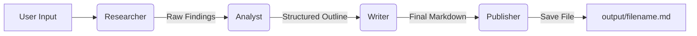

# Deep Research Crew 🕵️‍♂️📚

**A fully autonomous, local Multi-Agent System for in-depth research, analysis, and content creation.**

Built with **[CrewAI](https://crewai.com)** and **[Ollama](https://ollama.com)**, this project creates a team of AI agents that collaborate to research a topic, analyze the findings, write a comprehensive report, and save it to your local machine—all running locally on your hardware using 3B parameter models (like Qwen 2.5).

---

## 🌟 Features

* **100% Local Execution:** Uses Ollama to run quantized LLMs (e.g., Qwen 2.5 3B), ensuring privacy and zero cost.
* **Multi-Agent Pipeline:** Four specialized agents work sequentially:
    1.  **Senior Research Analyst:** Scours the web for recent developments, facts, and expert opinions.
    2.  **Critical Content Strategist:** Critiques the raw data, identifies gaps, and builds a logical outline.
    3.  **Lead Content Creator:** Drafts a professional, well-formatted Markdown report.
    4.  **File Publishing Utility:** Safely handles file I/O to save your report.
* **Real-Web Access:** Integrated **DuckDuckGo Search** allows agents to fetch real-time information.
* **Safe File System:** Custom `SafeFileWriteTool` ensures agents can only write to a designated `output/` directory.
* **Interactive CLI:** A continuous loop interface allows you to run multiple research tasks in one session.

---

## 🏗️ Architecture

The system operates on a "Chain of Thought" workflow:


## The Agents

1. **Senior Research Analyst:** Uses DuckDuckGoSearchTool to gather raw information.

2. **Critical Content Strategist:** Pure logic agent. Structures chaotic data into a coherent narrative.

3. **Lead Content Creator:** Creative agent. Writes engaging prose based on the strategist's outline.

4. **File Publishing Utility:** Functional agent. Strictly prohibited from "thinking" or "formatting"; its only job is to execute the save command.

## 🚀 Getting Started
### Prerequisites

- **Python 3.10+**

- **Ollama** installed and running.

### Installation
1. **Clone the repository:**

```Bash
git clone https://github.com/pranav-wakode/deep-research-crew.git
cd deep-research-crew
```
2. **Create and activate a virtual environment:**

```Bash
# Linux/Mac
python3 -m venv venv
source venv/bin/activate

# Windows
python -m venv venv
venv\Scripts\activate
```
3. **Install dependencies:**

```Bash
pip install -r requirements.txt
```
4. **Setup the Local Model:** Make sure Ollama is running, then pull the model used in the configuration (Qwen 2.5 3B Instruct is recommended for speed/quality balance):

```Bash
ollama pull yxchia/qwen2.5-3b-instruct:Q4_K_M
```
(Note: If you want to use a different model, edit 'model=' in 'src/agents.py').

## 🏃‍♂️ Usage
1. **Start the Ollama Server** (in a separate terminal):

```Bash
ollama serve
```
2. **Run the Crew:**

```Bash
python3 main.py
```
3. **Interact:**

- Enter your research topic when prompted (e.g., "The future of solid state batteries").

- The crew will execute the pipeline (Research -> Analyze -> Write -> Publish).

- Once finished, the script will tell you where the file is saved (e.g., 'output/the_future_of_solid_state_batteries.md').

## 📂 Project Structure
```Plaintext
deep-research-crew/
├── main.py               # Entry point (CLI loop, filename logic)
├── requirements.txt      # Python dependencies
├── output/               # Generated reports are saved here
└── src/
    ├── __init__.py
    ├── agents.py         # Agent definitions and LLM configuration
    ├── tasks.py          # Prompt engineering for specific tasks
    └── custom_tools.py   # Wrapper for Search and File System tools
```

## 📄 License
Distributed under the MIT License. See 'LICENSE' for more information.